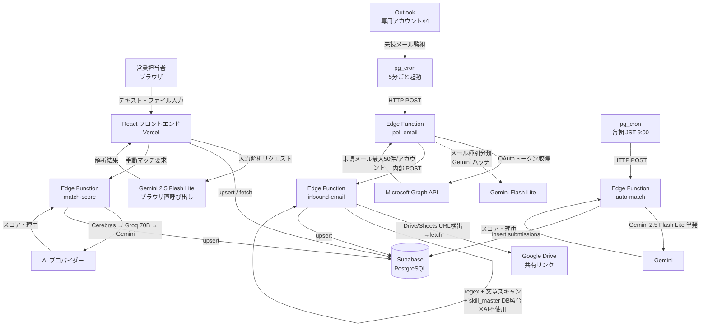

# AkiNavi HR-AI

「案件の空き」と「人材リソース」をAIで自動マッチングするシステム。  
**ログイン不要・ニックネーム制・即日利用可能。**

---

## できること

| 機能 | 説明 |
|---|---|
| AI マッチング | 案件と人材の相性スコア・理由をAIが自動生成（手動: `match-score` / 自動 cron: `auto-match`） |
| 人材登録 | テキスト貼り付け・Excel・Word・画像をアップロードするだけで自動解析・登録（PDF は現状未対応） |
| 案件登録 | 同上。メール本文や要件定義書をそのまま貼り付けてOK |
| メール自動取り込み | 専用 Outlook アドレスを 5 分ごとにポーリング → 取得 → DB 保存（AI 不使用・ルールベース） |
| デモ環境 | 本番データとは独立したデモ用データ環境（`?demo=KEY`でトグル） |

---

## システム構成図



---

## 技術スタック

| レイヤー | 技術 |
|---|---|
| フロントエンド | React 19, Vite 8, TypeScript, Tailwind CSS v4, TanStack Query v5 |
| DB / バックエンド | Supabase（PostgreSQL, Edge Functions, pg_cron, pg_net） |
| AI（ブラウザ・入力解析） | Gemini `gemini-2.5-flash-lite`（`VITE_GEMINI_MODEL` で変更可）・マルチモーダル対応 |
| AI（サーバー・マッチング） | `match-score`: Cerebras `llama3.1-8b` → Groq `llama-3.3-70b-versatile` → Gemini `gemini-2.5-flash`（フォールバック順）<br/>`auto-match`: Gemini `gemini-2.5-flash-lite` 単発 |
| AI（サーバー・メール種別分類） | `poll-email` の同一受信箱判別: Gemini `gemini-2.5-flash-lite` バッチ（任意・既定は無効） |
| メール解析 | **AI 不使用**。regex（`extractCandidateFieldsRegex`） + 文章スキャン（`extractFromProse`） + `skill_master` DB 照合（約 1,600 件） |
| ファイル解析 | `xlsx`（Excel）・`mammoth`（Word）・画像 base64（Gemini multimodal）。**PDF はテキスト解析対象外** |
| メール自動受信 | Microsoft Graph API + Supabase pg_cron（**完全無料・Make.com 不要**） |
| デプロイ | Vercel（フロント）/ Supabase（バックエンド） |
| テスト | Vitest, React Testing Library, MSW |

---

## 無料枠の限界（現状）

メール解析が AI 非依存になったため、**メール取り込みは無料枠の影響を受けません**。AI を消費するのは「マッチング処理」と「メール種別分類（任意）」のみ。

| AI | 役割 | 無料上限 | 備考 |
|---|---|---|---|
| Cerebras `llama3.1-8b` | `match-score`（手動マッチ）の 1 段目 | 実質無制限 | 軽量タスク向け |
| Groq `llama-3.3-70b-versatile` | `match-score` の 2 段目（精度重視） | 500K tokens/日（JST 9:00 リセット） | マッチング数百〜千件/日が目安 |
| Gemini `gemini-2.5-flash-lite` | `auto-match`（自動 cron）・ブラウザ入力解析・最終フォールバック | プリペイド制（要チャージ） | 1 マッチ ~1.5K tokens 程度 |

> マッチング処理が天井になる。メール処理は規模に関係なく無料で永続稼働。

---

## ローカル開発環境のセットアップ

### 前提条件

- [ ] Node.js 20 以上（`node -v` で確認）
- [ ] npm 9 以上（`npm -v` で確認）
- [ ] Git

### 手順

**1. リポジトリをクローン**

```bash
git clone https://github.com/kzmiyamura/akinavi-hr-ai.git
cd akinavi-hr-ai
```

**2. 依存パッケージをインストール**

```bash
npm install
```

**3. 環境変数を設定**

```bash
cp .env.example .env.local
```

`.env.local` を以下の内容で編集:

```env
# Supabase（Dashboard → Settings → API から取得）
VITE_SUPABASE_URL=https://argizomylbolpqxgmvim.supabase.co
VITE_SUPABASE_ANON_KEY=（anon キーを貼り付け）

# Gemini（Google AI Studio から取得）
VITE_GEMINI_API_KEY=（APIキーを貼り付け）
VITE_AI_PROVIDER=gemini

# デモ環境の解除キー（任意・未設定でもOK）
VITE_DEMO_KEY=（任意の文字列）
```

**4. Supabase の DB を初期化**

Supabase Dashboard → SQL Editor で以下を**順番に**実行:

1. `supabase/schema.sql`
2. `supabase/migrations/` 配下の SQL を **ファイル名の昇順で全て**実行  
   （`skill_master` / `relevance_keywords` / `box_columns` / `resume_url` / `auto_match_cron` / `skill_cleanup_cron` / `attachments_bucket` / `find_duplicate_candidates_rpc` / `search_rpc` / `enrich_cron` などが順次必要）

> `schema.sql` の `candidate_skills.check_category` は旧 11 カテゴリのまま放置されています。`add_candidate_skills.sql` で 14 カテゴリへ上書きされるため、必ず `migrations/` を全て流すこと。

**5. 開発サーバーを起動**

```bash
npm run dev
```

ブラウザで `http://localhost:5173` を開く。

---

## 本番デプロイ手順

### Vercel（フロントエンド）

Vercel Dashboard → Environment Variables に以下を設定してから `main` ブランチへ push:

| 変数名 | 値 |
|---|---|
| `VITE_SUPABASE_URL` | Supabase の URL |
| `VITE_SUPABASE_ANON_KEY` | Supabase の anon キー |
| `VITE_GEMINI_API_KEY` | Gemini API キー |
| `VITE_AI_PROVIDER` | `gemini` |
| `VITE_DEMO_KEY` | デモ解除キー（任意） |

### Supabase Edge Functions

```bash
supabase functions deploy inbound-email
supabase functions deploy poll-email
supabase functions deploy auto-match
supabase functions deploy match-score
supabase functions deploy microsoft-oauth
supabase functions deploy enrich-candidate
```

**Edge Functions Secrets**（Supabase Dashboard → Edge Functions → Secrets）

| Secret 名 | 用途 | 必須 |
|---|---|---|
| `GROQ_API_KEY` | `match-score` 2 段目・`poll-email` 種別分類フォールバック | ◎ |
| `CEREBRAS_API_KEY` | `match-score` 1 段目（軽量・無料） | 推奨 |
| `GEMINI_API_KEY` | `auto-match` 単発・`match-score` 最終フォールバック・画像解析 | ◎ |
| `GRAPH_CLIENT_ID` | Azure AD アプリのクライアント ID | ◎ |
| `GRAPH_CLIENT_SECRET` | Azure AD アプリのクライアントシークレット | ◎ |
| `GRAPH_REFRESH_TOKEN_HUMAN` | 人材用メール（prod）のリフレッシュトークン | ◎ |
| `GRAPH_REFRESH_TOKEN_PROJECT` | 案件用メール（prod）のリフレッシュトークン | ◎ |
| `GRAPH_REFRESH_TOKEN_HUMAN_DEV` | 人材用メール（demo）のリフレッシュトークン | 任意 |
| `GRAPH_REFRESH_TOKEN_PROJECT_DEV` | 案件用メール（demo）のリフレッシュトークン | 任意 |
| `INBOUND_CALL_KEY` | poll-email → inbound-email 呼び出し用 JWT（service_role キー） | ◎ |
| `GOOGLE_SERVICE_ACCOUNT_JSON` | Google Sheets/Drive（Box 連携キュー）アクセス用 | Box 連携時 |
| `BOX_SPREADSHEET_ID` | Box 連携キュー用スプレッドシート ID | Box 連携時 |

**pg_cron スケジュール登録**

以下の SQL 内 `YOUR_PROJECT_REF` と `YOUR_SERVICE_ROLE_KEY` を実際の値に書き換えて SQL Editor で実行：
- `supabase/migrations/add_email_polling_cron.sql`（5 分ごと: poll-email）
- `supabase/migrations/add_auto_match_cron.sql`（毎朝 JST 9:00: auto-match）
- `supabase/migrations/add_skill_cleanup_cron.sql`（毎日 JST 3:00: skill-master-cleanup）
- `supabase/migrations/add_enrich_cron.sql`（Box 連携時のみ）

---

## アプリ設定（`app_config` テーブル）

Edge Function 群の挙動はソースを書き換えずに app_config キーで切替できる。設定タブの UI から変更するか、Supabase SQL Editor で直接更新する。

| キー | 既定 | 内容 |
|---|---|---|
| `inbound_project_enabled` | `false` | **案件メールの解析と DB 保存を有効化**。`'true'` を設定すると `inbound-email` が type=project を処理（既定は人材メールのみ取り込み） |
| `email_poll_mode` | `incremental` | `incremental`（未読のみ）か `full`（指定日以降全件） |
| `email_full_import_since` | （未設定） | `email_poll_mode=full` 時に取得を開始する ISO 日時 |
| `email_classify_enabled` | `false` | 同一受信箱に人材/案件が混在するとき、Gemini で `candidate`/`project`/`other` をバッチ分類 |
| `graph_rt_human_prod` ほか | — | Microsoft OAuth 連携で保存されるリフレッシュトークン（4 アカウント分） |

`auto-match` の挙動切替は環境変数（Supabase Secrets）で行う:

| Secret | 既定 | 内容 |
|---|---|---|
| `AUTO_MATCH_ENABLED` | `false` | `true` で `inbound-email` 経由の即時自動マッチングも有効化（普段は cron 経由のみ） |

---

## テスト実行

```bash
npm run test:run   # 全テスト（CI向け）
npm run test       # ウォッチモード（開発向け）
```

`scripts/verify_email_extraction.mjs` はメール解析の品質を一発でチェックする Node スクリプト（要 Node 20+）。

```bash
node scripts/verify_email_extraction.mjs
```

---

## リファレンス

### メール受信アドレス

5 分ごとに未読メールを自動取得・解析・DB 保存。処理完了後に既読マーク。

| 種別 | アドレス | data_env |
|---|---|---|
| 人材登録用（本番） | `akinavi.hr.ai.voice.human@outlook.jp` | `prod` |
| 案件登録用（本番） | `akinavi.hr.ai.voice.project@outlook.jp` | `prod` |
| 人材登録用（デモ） | dev 用アカウント | `demo` |
| 案件登録用（デモ） | dev 用アカウント | `demo` |

### メール自動受信フロー（Graph API ポーリング・AI 不使用）

```
pg_cron（5分ごと）
  ↓ HTTP POST
poll-email Edge Function
  ├─ Graph API: リフレッシュトークン → アクセストークン取得（ローテーション保存）
  ├─ GET /me/messages?$filter=isRead eq false（最大50件/アカウント、ページネーション継続）
  ├─ メール種別分類（任意・既定 OFF）: Gemini バッチで candidate/project/other 判定
  │     → other はそのまま既読マークしてスキップ
  ├─ 各メール処理:
  │   1. markAsRead（二重処理防止）
  │   2. 添付ファイル取得
  │   3. inbound-email へ POST
  │   4. 失敗時は markAsUnread（次回再試行）
  └─ 4アカウントを Promise.allSettled で並列処理
  ↓ 内部POST
inbound-email Edge Function（※ AI は呼ばない）
  ├─ HTML → プレーンテキスト化 + HTML エンティティデコード
  ├─ URL 除去・送信者署名除去（誤マッチ対策）
  ├─ Google Drive / Sheets / Docs URL 検出・自動取得
  ├─ Word / Excel 添付 → テキスト変換（PDF は Storage に保存するだけ）
  ├─ 複数人材検出: 区切り線（*****／─── 等）で 1 メール = 複数候補者対応
  ├─ skill_master DB 照合（本文と添付で別ロジック、添付は上位 20 件・D/E評価除外）
  ├─ extractCandidateFieldsRegex: 氏名・最寄駅・都道府県・経験年数・希望単価・参画時期・希望案件
  ├─ extractFromProse: 役割・業界・リモート可否（フェーズ表ヘッダーは除外）
  ├─ 駅 → 都道府県マッピングで送信者署名由来の誤判定を上書き
  ├─ 重複疑い: 名前一致 + スキル Jaccard ≥ 0.4 → duplicate_flag=true
  └─ DB保存（candidates / projects / candidate_skills / ai_logs ※ ai_logs.model='no-ai'）
```

### マッチング（AI 使用）

| 方式 | トリガー | 対象人材数上限 | AI フォールバック順 |
|---|---|---|---|
| `match-score` | 手動（UI ボタン） | 高速モード: 案件あたり 20 / 人材あたり 10 | Cerebras → Groq 70B → Gemini |
| `auto-match` | 毎朝 JST 9:00 cron | 直近 25 時間以内に登録された案件 ×最大 40 名 | Gemini 単発のみ（フォールバックなし） |

### ブラウザからのファイル解析フロー

```
ファイル選択（Excel / Word / 画像）
  ├─ Excel  → xlsx (SheetJS) で全シートを CSV 変換 → テキストエリアへ転記
  ├─ Word   → mammoth で本文抽出 → テキストエリアへ転記
  └─ 画像   → base64変換 → Gemini multimodal API（inlineData）で直接解析
  ↓
Gemini 2.5 Flash Lite で解析 → Supabase に保存
```

> **PDF は現状未対応**。PDF を渡された場合は UI 側でエラー表示し処理を中断する。回避策: テキストを手動で貼り付ける、または PDF をページ画像化して添付する。

### データ環境（prod / demo）

同一 Supabase 内でデータを論理分離。`data_env` カラムでフィルタリング。

| 環境 | 用途 | 切替方法 |
|---|---|---|
| `prod` | 本番データ（実際の人材・案件） | デフォルト |
| `demo` | 営業デモ用サンプルデータ | URLに `?demo=<VITE_DEMO_KEY>` を付加 |

### DB テーブル一覧

| テーブル | 用途 |
|---|---|
| `candidates` | 人材マスタ（`data_env` で prod/demo 分離）。後述の主要カラム参照 |
| `projects` | 案件マスタ（`data_env` で prod/demo 分離） |
| `submissions` | マッチング提案履歴（スコア・AI要約） |
| `candidate_skills` | スキルのカテゴリ別管理（14カテゴリ・CHECK制約） |
| `ai_logs` | AI 解析実行ログ（モデル名・所要時間・結果・エラー。`model='no-ai'` でメール解析記録） |
| `skill_master` | スキル辞書（約 1,600 件 + AI 自動登録分）。`aliases` で表記ゆれ吸収、`match_count` で実績管理 |
| `relevance_keywords` | 関連度判定用キーワード（`exclude` / `candidate` / `project` の 3 種別） |
| `app_config` | アプリ設定 / Graph API リフレッシュトークンのローテーション保存 |

### `candidates` テーブルの主要カラム

| カラム | 内容 |
|---|---|
| `data_env` | `prod` または `demo` |
| `name` | 候補者名（イニシャル可）。抽出失敗時は `'不明'` |
| `email` / `phone` | 候補者本人の連絡先（あれば） |
| `skills` (jsonb) | フラットなスキル名配列（`skill_master` 由来） |
| `experience_years` | 経験年数（年単位） |
| `raw_profile` (jsonb) | 元メール本文・添付テキスト・抽出メタデータ・スキル分類などを保持 |
| `desired_rate` | 希望単価（例: `"65万円以上"`） |
| `from_company` | 営業会社名（送信者署名から抽出） |
| `box_url` / `box_status` | Box 共有 URL と取り込みステータス（`pending` / `enriched` / `failed`） |
| `resume_url` | Supabase Storage 上の履歴書 URL |
| `drive_url` | Google Drive 共有 URL |
| `duplicate_flag` | 重複候補と判定された場合 true |
| `merged_into` | 重複マージ先の候補者 ID |

### candidate_skills の14カテゴリ

| カテゴリキー | 内容・例 |
|---|---|
| `languages` | Python, TypeScript, SQL 等 |
| `frameworks` | React, Laravel, Django 等 |
| `libraries` | jQuery, NumPy 等 |
| `os` | Linux, Windows, macOS 等 |
| `databases` | PostgreSQL, Redis, MongoDB 等 |
| `dwh` | Snowflake, BigQuery, Tableau 等 |
| `clouds` | AWS, GCP, Azure 等 |
| `infrastructures` | Docker, Kubernetes, Terraform 等 |
| `tools` | Git, Jira, Slack, JP1, Teraterm 等 |
| `methodologies` | アジャイル, スクラム, PM 等 |
| `certifications` | AWS認定, 情報処理技術者, ITパスポート 等 |
| `design` | Figma, Illustrator, Photoshop 等 |
| `marketing` | SEO, SNS運用, Web広告 等 |
| `others` | 上記以外 |

### ディレクトリ構成

```
akinavi-hr-ai/
├── src/
│   ├── lib/
│   │   ├── ai/               # AI プロバイダー抽象化（ブラウザ用）
│   │   │   ├── types.ts      #   型定義（リクエスト・レスポンス）
│   │   │   ├── geminiProvider.ts  #   Gemini 実装（マルチモーダル対応）
│   │   │   ├── openaiProvider.ts  #   OpenAI スタブ（未実装）
│   │   │   └── index.ts      #   プロバイダー切替ファクトリ
│   │   ├── db/               # DB 操作
│   │   │   ├── candidates.ts
│   │   │   ├── projects.ts
│   │   │   ├── submissions.ts
│   │   │   ├── emailSettings.ts
│   │   │   └── matchingSettings.ts
│   │   ├── fileParser.ts     # Excel / Word テキスト抽出、画像 base64 変換（PDF 非対応）
│   │   ├── dataEnv.ts        # prod/demo 環境切替
│   │   └── supabase.ts
│   ├── pages/                # 各画面（Matching / Candidate / Project / Settings ほか）
│   │                         # ※ History / Duplicate / Monitor は実装済みだがナビから非表示
│   └── components/           # 共通 UI（DemoSeedPanel 等）
├── supabase/
│   ├── schema.sql            # DB テーブル定義・RLS ポリシー
│   ├── migrations/           # 追加マイグレーション SQL（昇順で全て実行）
│   └── functions/
│       ├── inbound-email/    # メール解析 Edge Function（AI 不使用・regex + DB 照合）
│       ├── poll-email/       # Outlook ポーリング Edge Function（5 分ごと cron）
│       ├── auto-match/       # 自動マッチング Edge Function（毎朝 JST 9:00 cron・Gemini 単発）
│       ├── match-score/      # スコア計算 Edge Function（UI から呼び出し・Cerebras→Groq→Gemini）
│       ├── microsoft-oauth/  # Microsoft OAuth 認証 Edge Function
│       ├── enrich-candidate/ # Box 連携・再解析 Edge Function（毎日 JST 3:00 cron）
│       └── skill-master-cleanup/ # skill_master クリーンアップ Edge Function（毎日 cron）
├── scripts/
│   └── verify_email_extraction.mjs  # メール解析の品質検証用 Node スクリプト
└── docs/
    ├── Sales_Manual.md       # 営業担当者向け操作マニュアル
    ├── HandsOn_Setup.md      # 環境構築ガイド（後任エンジニア向け）
    ├── ai_fallback_flow.md   # AI フォールバックフロー詳細
    ├── matching_candidate_selection.md  # マッチング選定ロジック
    ├── DataEnv_Demo_Prod.md  # データ環境（prod/demo）の使い分け
    ├── Outlook_AutoForward_Setup.md     # Outlook 自動転送ルール設定
    ├── AWS_Account_Setup_Guide.md       # AWS アカウント作成（参考資料）
    ├── AI_Freetier_Challenges.md        # 無料枠と現状の限界（歴史的記述含む）
    └── test-reports/         # テストレポート
```

---

## 問い合わせ・引き継ぎ

- GitHub: [kzmiyamura/akinavi-hr-ai-aws](https://github.com/kzmiyamura/akinavi-hr-ai-aws)
- Supabase プロジェクト ID: `argizomylbolpqxgmvim`
