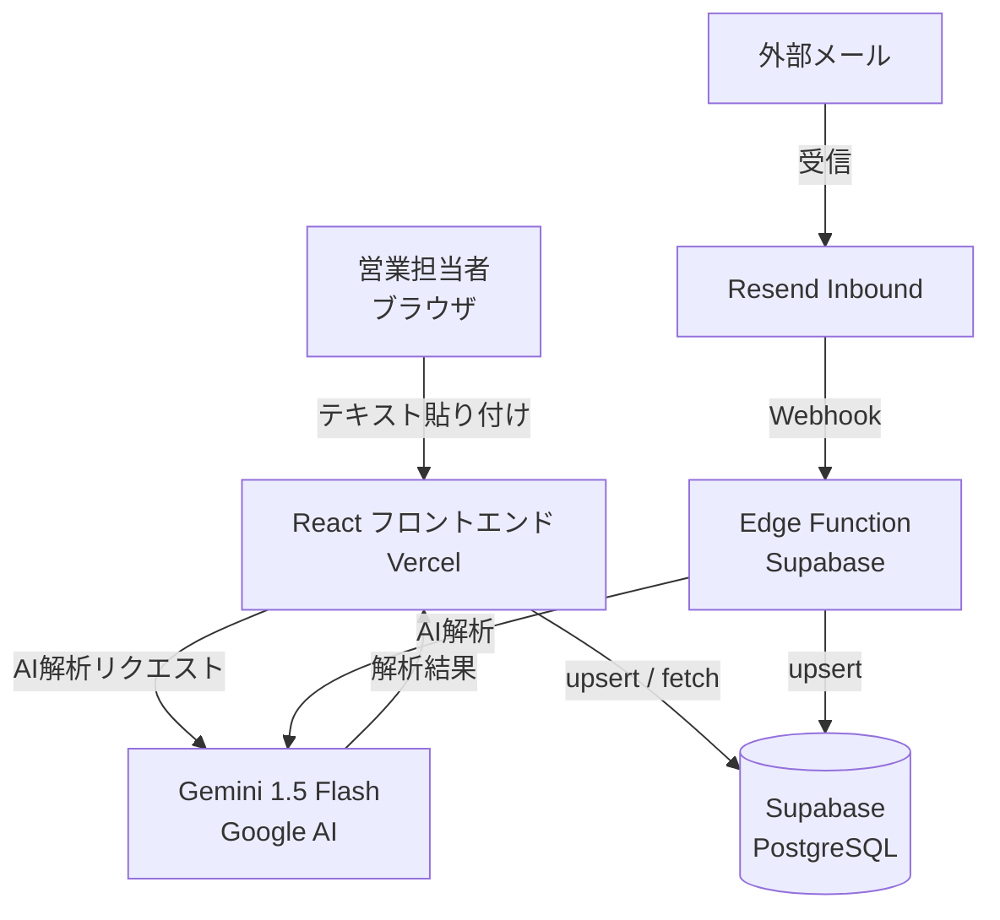

# AkiNavi HR-AI

「案件の空き」と「人材リソース」をAIで最適マッチングするシステム。  
ログイン不要・ニックネーム制で即日利用可能。

---

## システム構成



---

## 技術スタック

| レイヤー | 技術 |
|---|---|
| フロントエンド | React 18, Vite, TypeScript, Tailwind CSS v4 |
| 状態管理 | TanStack Query v5 |
| DB / バックエンド | Supabase (PostgreSQL, Edge Functions) |
| AI | Google Gemini 1.5 Flash（`VITE_AI_PROVIDER=openai` で GPT-4o に切替可） |
| メール自動受信 | Resend Inbound Webhook |
| デプロイ | Vercel（フロント）/ Supabase（バックエンド） |
| テスト | Vitest, React Testing Library, MSW |

---

## ローカル開発環境の構築手順

### 前提条件

- Node.js 18 以上
- npm 9 以上
- Supabase CLI（`brew install supabase/tap/supabase`）
- Git

### 1. リポジトリをクローン

```bash
git clone https://github.com/kzmiyamura/akinavi-hr-ai.git
cd akinavi-hr-ai
```

### 2. 依存パッケージをインストール

```bash
npm install
```

### 3. 環境変数を設定

```bash
cp .env.example .env.local
```

`.env.local` を編集して以下を埋める:

```env
VITE_SUPABASE_URL=https://argizomylbolpqxgmvim.supabase.co
VITE_SUPABASE_ANON_KEY=（Supabase ダッシュボード → Settings → API から取得）
VITE_GEMINI_API_KEY=（Google AI Studio から取得）
VITE_AI_PROVIDER=gemini
RESEND_API_KEY=（Resend ダッシュボード → API Keys から取得）
```

### 4. Supabase DB を初期化

Supabase ダッシュボード → SQL Editor で `supabase/schema.sql` を実行する。

### 5. 開発サーバーを起動

```bash
npm run dev
```

ブラウザで `http://localhost:5173` を開く。

---

## 本番デプロイ手順

### Vercel（フロントエンド）

1. Vercel ダッシュボード → プロジェクト → Settings → Environment Variables に `.env.local` の内容を追加
2. GitHub の `main` ブランチへの push で自動デプロイ

### Supabase Edge Function（メール自動受信）

```bash
# Secrets 登録
supabase secrets set GEMINI_API_KEY=xxx --project-ref argizomylbolpqxgmvim

# デプロイ
supabase functions deploy inbound-email --project-ref argizomylbolpqxgmvim
```

Webhook URL:
```
https://argizomylbolpqxgmvim.supabase.co/functions/v1/inbound-email
```

---

## AI プロバイダーの切り替え

`.env.local` と Vercel 環境変数を変更するだけで切り替え可能。

| プロバイダー | 設定値 | 必要なキー |
|---|---|---|
| Gemini 1.5 Flash（デフォルト） | `VITE_AI_PROVIDER=gemini` | `VITE_GEMINI_API_KEY` |
| OpenAI GPT-4o | `VITE_AI_PROVIDER=openai` | `OPENAI_API_KEY` |

OpenAI に切り替える場合は `src/lib/ai/openaiProvider.ts` に実装を追加する。

---

## テスト実行

```bash
# 全テストを実行
npm run test:run

# ウォッチモード
npm run test
```

### テスト結果（2026-04-30 時点）

| フェーズ | 件数 |
|---|---|
| Phase 2 AI Wrapper | 9件 ✅ |
| Phase 2 DB ロジック | 8件 ✅ |
| Phase 3 結合テスト | 10件 ✅ |
| Phase 4 メール解析 | 19件 ✅ |
| **合計** | **46件 全パス** |

詳細は `docs/test-reports/` を参照。

---

## ディレクトリ構成

```
akinavi-hr-ai/
├── src/
│   ├── lib/
│   │   ├── ai/              # AI プロバイダー抽象化
│   │   │   ├── types.ts     # 共通インターフェース
│   │   │   ├── geminiProvider.ts
│   │   │   ├── openaiProvider.ts  # 切替用スタブ
│   │   │   └── index.ts     # ファクトリ（環境変数で切替）
│   │   ├── db/              # DB 操作
│   │   │   ├── candidates.ts
│   │   │   ├── projects.ts
│   │   │   └── submissions.ts
│   │   ├── inbound/         # メール解析ロジック
│   │   └── supabase.ts      # Supabase クライアント
│   ├── components/          # 共通 UI
│   ├── pages/               # 各画面
│   └── hooks/               # カスタムフック
├── supabase/
│   ├── schema.sql           # DB テーブル定義 + RLS ポリシー
│   └── functions/
│       └── inbound-email/   # Resend Webhook Edge Function
└── docs/
    └── test-reports/        # テスト項目書 兼 結果報告書
```

---

## DB 設計のポイント

### candidates テーブル（人材マスタ）

| カラム | 説明 |
|---|---|
| `email` | UNIQUE インデックス。同じメールなら自動で上書き更新 |
| `duplicate_flag` | AI が「名前・スキルが類似」と判断した場合に `true` |
| `merged_into` | 名寄せ済みの場合、統合先の `candidate_id` をセット（論理削除） |
| `created_by` | 登録者のニックネーム、または `resend-inbound`（自動登録） |

---

## 問い合わせ・引き継ぎ

- GitHub: [kzmiyamura/akinavi-hr-ai](https://github.com/kzmiyamura/akinavi-hr-ai)
- Supabase プロジェクト: `argizomylbolpqxgmvim`
