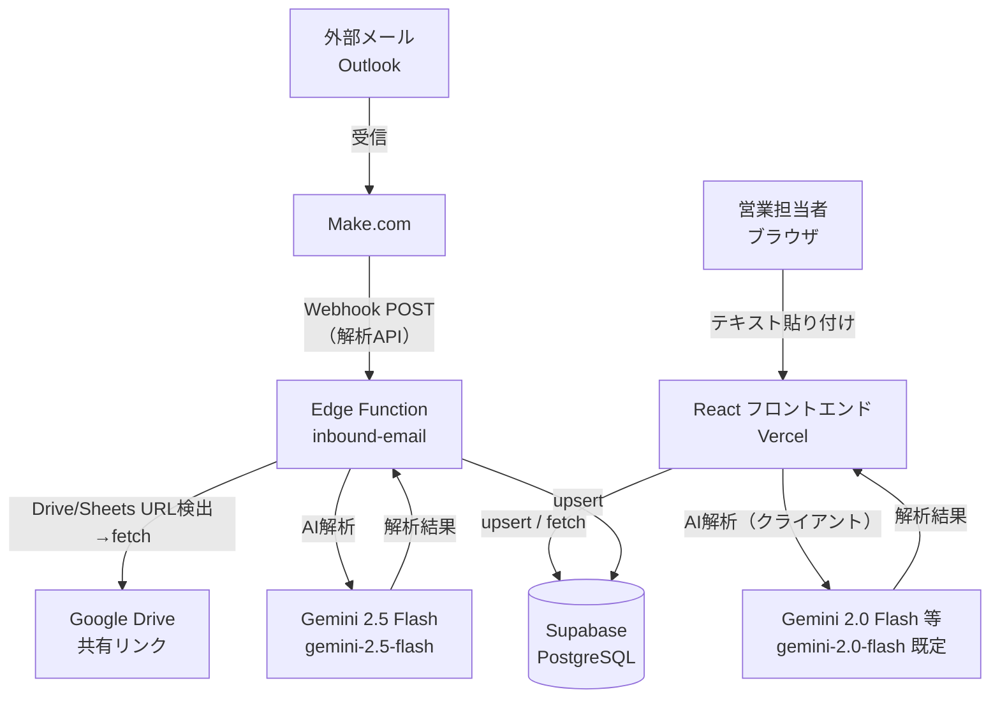

# AkiNavi HR-AI

「案件の空き」と「人材リソース」をAIで最適マッチングするシステム。  
ログイン不要・ニックネーム制で即日利用可能。

---

## 画面（現状）

- **マッチング結果**（初期表示）
- **人材登録**
- **案件登録**

※提案履歴・重複管理・解析監視は実装が残っていても、現状のナビからは非表示です（運用をシンプルにするため）。

---

## システム構成



**サーバー側のメール／Webhook 解析API**は **Supabase Edge Function `inbound-email` に集約**している（以前の Vercel Serverless `api/analyze` から移設済み）。Make.com 等の送信先は Supabase の Functions URL のみを使う。

---

## 技術スタック

| レイヤー | 技術 |
|---|---|
| フロントエンド | React 19, Vite 8, TypeScript, Tailwind CSS v4 |
| 状態管理 | TanStack Query v5 |
| DB / バックエンド | Supabase (PostgreSQL, Edge Functions) |
| AI（ブラウザ・Vite） | Google Gemini（既定 `gemini-2.0-flash`、`VITE_GEMINI_MODEL` で変更可）— `src/lib/ai/geminiProvider.ts` |
| AI（サーバー・Edge） | Google Gemini（`gemini-2.5-flash`）— **`supabase/functions/inbound-email`**（Make.com Webhook → 解析 → DB） |
| メール自動受信 | Outlook 専用アカウント + Make.com Webhook |
| デプロイ | Vercel（フロント）/ Supabase（バックエンド） |
| テスト | Vitest, React Testing Library, MSW |

---

## メール受信アドレス

| 種別 | アドレス |
|---|---|
| 人材登録用 | `akinavi.hr.ai.voice.human@outlook.jp` |
| 案件登録用 | `akinavi.hr.ai.voice.project@outlook.jp` |

---

## ローカル開発環境の構築手順

### 前提条件

- Node.js 20 以上（Vite 8 推奨環境）
- npm 9 以上
- Supabase CLI（`brew install supabase/tap/supabase`）
- Git

### 1. リポジトリをクローン

```bash
git clone https://github.com/kzmiyamura/akinavi-hr-ai.git
cd akinavi-hr-ai
```

### 2. 依存パッケージをインストール

```bash
npm install
```

### 3. 環境変数を設定

```bash
cp .env.example .env.local
```

`.env.local` を編集して以下を埋める:

```env
VITE_SUPABASE_URL=https://argizomylbolpqxgmvim.supabase.co
VITE_SUPABASE_ANON_KEY=（Supabase ダッシュボード → Settings → API から取得）
VITE_GEMINI_API_KEY=（Google AI Studio から取得）
VITE_AI_PROVIDER=gemini
```

その他のキー（任意の `RESEND_API_KEY` 等）は `.env.example` を参照。サーバー側の `GEMINI_API_KEY` は **Supabase Functions の Secrets** で設定する（ローカルフロントのみなら不要なこともある）。

### 4. Supabase DB を初期化

Supabase ダッシュボード → SQL Editor で `supabase/schema.sql` を実行する。

続けて、未適用のものから `supabase/migrations/` 以下の SQL を**ファイル名の順に**実行する（`candidate_skills` のカテゴリ制約などはマイグレーション側が最新）。

**注意:** リポジトリ内の `schema.sql` と `migrations/add_candidate_skills.sql` の `candidate_skills` 定義は異なる場合があります。新規環境ではマイグレーション適用後の制約を正としてください。

### 5. 開発サーバーを起動

```bash
npm run dev
```

ブラウザで `http://localhost:5173` を開く。

---

## 本番デプロイ手順

### Vercel（フロントエンド）

1. Vercel ダッシュボード → Settings → Environment Variables に、**フロント用**を設定:
   - `VITE_SUPABASE_URL`
   - `VITE_SUPABASE_ANON_KEY`
   - `VITE_GEMINI_API_KEY`
   - `VITE_AI_PROVIDER=gemini`
2. GitHub の `main` ブランチへの push で自動デプロイ

メール自動解析は Vercel 上では動かさず、次項の **Supabase Edge Function** の Secrets に `GEMINI_API_KEY` 等を置く。

### Supabase Edge Function（メール自動受信・サーバー側解析API）

```bash
# Secrets 登録
supabase secrets set GEMINI_API_KEY=xxx --project-ref argizomylbolpqxgmvim
supabase secrets set SUPABASE_URL=https://argizomylbolpqxgmvim.supabase.co --project-ref argizomylbolpqxgmvim
supabase secrets set SUPABASE_SERVICE_ROLE_KEY=xxx --project-ref argizomylbolpqxgmvim

# デプロイ
supabase functions deploy inbound-email --project-ref argizomylbolpqxgmvim
```

Webhook URL（Make.com の送信先に設定）:
```
https://argizomylbolpqxgmvim.supabase.co/functions/v1/inbound-email
```

Make.com の POST パラメータ:

| パラメータ | 内容 |
|---|---|
| `type` | `candidate`（人材）または `project`（案件） |
| `from` | 差出人メールアドレス |
| `subject` | 件名 |
| `body` | 本文（HTML可・自動でプレーンテキスト化） |
| `attachment[data]` | 添付ファイルのBase64（PDF/PNG/JPEG等） |
| `attachment[mimeType]` | 添付ファイルのMIMEタイプ |
| `attachment[name]` | 添付ファイル名 |

---

## AI 解析フロー（自動取り込み）

```
メール受信（Make.com）→ Supabase Edge Function `inbound-email`
  ↓
本文の HTML タグを自動除去（プレーンテキスト化）
  ↓
本文中の Google Drive / Sheets / Docs URL を検出・自動取得
  ├─ Sheets → CSV export（認証不要・公開共有リンク前提）
  ├─ Docs   → plain text export
  └─ Drive  → PDF download → base64化してGeminiに渡す
  ↓
Gemini AI 解析（PDF添付 + テキスト、temperature=0）
  ↓（空結果の場合は最大2回リトライ）
抽出結果を DB に保存
  ├─ candidates / projects テーブル（upsert）
  ├─ candidate_skills テーブル（カテゴリ別・再INSERT。制約は `migrations/add_candidate_skills.sql` 参照）
  └─ ai_logs テーブル（実行ログ・所要時間・エラー）
```

---

## AI 解析フロー（ブラウザ貼り付け）

- 人材登録・案件登録のテキスト貼り付けは **フロント（Vite）から Gemini を呼び出し**、解析結果を Supabase に保存する。
- 人材は `skills`（フラット配列）に加え、可能な限り `raw_profile.skillsByCategory`（14カテゴリ）等も保存し、画面で色分け表示する。

---

## DB 設計

### テーブル一覧

| テーブル | 用途 |
|---|---|
| `candidates` | 人材マスタ |
| `projects` | 案件マスタ |
| `submissions` | マッチング提案履歴 |
| `candidate_skills` | スキルのカテゴリ別管理（検索最適化・制約はマイグレーション準拠） |
| `ai_logs` | AI解析実行ログ |
| `app_config` | アプリ全体設定 |

### candidate_skills のカテゴリ定義

`supabase/migrations/add_candidate_skills.sql` の CHECK 制約に準拠（**14 カテゴリ**）。

| カテゴリ | 内容・例 |
|---|---|
| `languages` | プログラミング・クエリ言語（例: Python, TypeScript, SQL） |
| `frameworks` | フレームワーク（例: React, Laravel, Django） |
| `libraries` | ライブラリ・UI キット等 |
| `os` | OS（例: Linux, Windows, macOS） |
| `databases` | RDB・NoSQL・KVS（例: PostgreSQL, Redis） |
| `dwh` | DWH・BI（例: Snowflake, BigQuery） |
| `clouds` | クラウドサービス（例: AWS, GCP, Azure） |
| `infrastructures` | コンテナ・IaC 等（例: Docker, Kubernetes, Terraform） |
| `tools` | Git, Jira, Slack, Notion 等 |
| `methodologies` | PM・開発プロセス（例: アジャイル, スクラム） |
| `certifications` | 資格・認定 |
| `design` | デザインツール・クリエイティブ |
| `marketing` | マーケ・集客 |
| `others` | 上記以外 |

### candidates テーブルの主要カラム

| カラム | 説明 |
|---|---|
| `email` | UNIQUE インデックス。同じメールなら自動で上書き更新 |
| `skills` | フラットなスキル配列（jsonb） |
| `raw_profile` | AI解析生データ・skillsByCategory・roles・industries等を格納 |
| `duplicate_flag` | AI が「名前・スキルが類似」と判断した場合に `true` |
| `merged_into` | 名寄せ済みの場合、統合先の `candidate_id` をセット（論理削除） |
| `created_by` | 登録者のニックネーム、または `make-inbound`（自動登録） |

---

## AI プロバイダーの切り替え

| プロバイダー | 設定値 | モデル（フロント） |
|---|---|---|
| Gemini（デフォルト） | `VITE_AI_PROVIDER=gemini` | 既定 `gemini-2.0-flash`（`VITE_GEMINI_MODEL` で上書き） |
| OpenAI | `VITE_AI_PROVIDER=openai` | 未実装（スタブ。`openaiProvider.ts` に実装が必要） |

サーバー側の自動解析は **Edge `inbound-email` のみ**。Supabase Secrets の `GEMINI_API_KEY` とモデル ID `gemini-2.5-flash` を使用。OpenAI への切替はサーバー未対応。

リポジトリに `api/analyze.ts` が残っている場合は **移設前の Vercel Serverless の名残**（本番の Webhook では未使用）。

---

## テスト実行

```bash
# 全テストを実行
npm run test:run

# ウォッチモード
npm run test
```

---

## ディレクトリ構成

```
akinavi-hr-ai/
├── api/
│   └── analyze.ts            # レガシー: 移設前の Vercel 解析API（本番Webhookでは未使用）
├── src/
│   ├── lib/
│   │   ├── ai/               # AI プロバイダー抽象化
│   │   │   ├── types.ts
│   │   │   ├── geminiProvider.ts
│   │   │   ├── openaiProvider.ts
│   │   │   └── index.ts
│   │   ├── db/               # DB 操作
│   │   │   ├── candidates.ts
│   │   │   ├── projects.ts
│   │   │   └── submissions.ts
│   │   ├── inbound/          # メール解析ロジック
│   │   └── supabase.ts
│   ├── pages/                # 各画面
│   └── components/           # 共通 UI
├── supabase/
│   ├── schema.sql             # DB テーブル定義 + RLS ポリシー
│   ├── migrations/            # 追加マイグレーション SQL
│   └── functions/
│       └── inbound-email/     # Make.com Webhook Edge Function
│           └── index.ts
└── docs/
    └── test-reports/
```

---

## 問い合わせ・引き継ぎ

- GitHub: [kzmiyamura/akinavi-hr-ai](https://github.com/kzmiyamura/akinavi-hr-ai)
- Supabase プロジェクト: `argizomylbolpqxgmvim`
