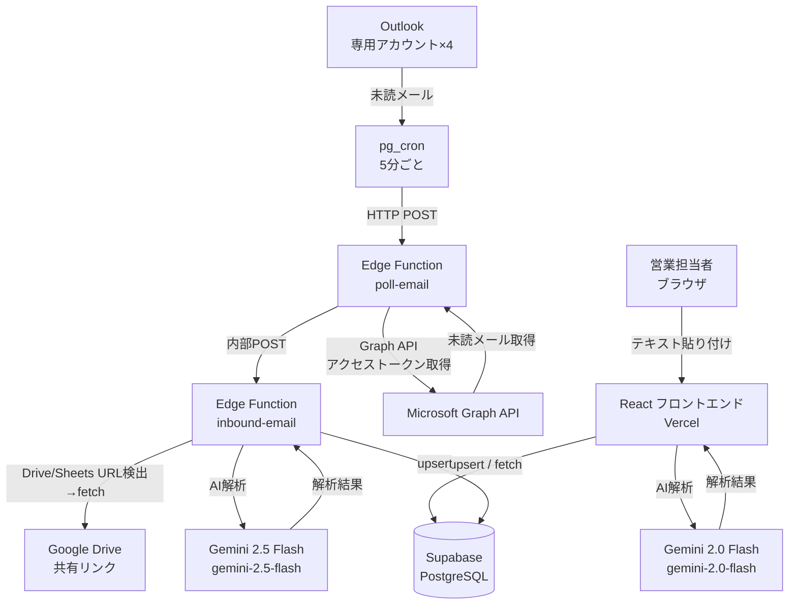

# AkiNavi HR-AI

「案件の空き」と「人材リソース」をAIで最適マッチングするシステム。  
ログイン不要・ニックネーム制で即日利用可能。

---

## 画面構成

- **マッチング結果**（初期表示）
- **人材登録**
- **案件登録**

※提案履歴・重複管理・解析監視は実装済みだが、現状のナビからは非表示（運用をシンプルにするため）。

---

## システム構成



---

## 技術スタック

| レイヤー | 技術 |
|---|---|
| フロントエンド | React 19, Vite 8, TypeScript, Tailwind CSS v4 |
| 状態管理 | TanStack Query v5 |
| DB / バックエンド | Supabase (PostgreSQL, Edge Functions, pg_cron, pg_net) |
| AI（ブラウザ） | Google Gemini（既定 `gemini-2.0-flash`、`VITE_GEMINI_MODEL` で変更可） |
| AI（サーバー） | Google Gemini `gemini-2.5-flash` — `supabase/functions/inbound-email` |
| メール自動受信 | Microsoft Graph API ポーリング + Supabase pg_cron（**Make.com不要・完全無料**） |
| デプロイ | Vercel（フロント）/ Supabase（バックエンド） |
| テスト | Vitest, React Testing Library, MSW |

---

## メール受信アドレス

| 種別 | アドレス | data_env |
|---|---|---|
| 人材登録用（本番） | `akinavi.hr.ai.voice.human@outlook.jp` | `prod` |
| 案件登録用（本番） | `akinavi.hr.ai.voice.project@outlook.jp` | `prod` |
| 人材登録用（デモ） | dev用アカウント | `demo` |
| 案件登録用（デモ） | dev用アカウント | `demo` |

5分ごとに未読メールを自動取得・解析・DB保存。処理完了後に既読マーク。

---

## ローカル開発環境の構築手順

### 前提条件

- Node.js 20 以上
- npm 9 以上
- Supabase CLI（`brew install supabase/tap/supabase`）
- Git

### 1. リポジトリをクローン

```bash
git clone https://github.com/kzmiyamura/akinavi-hr-ai.git
cd akinavi-hr-ai
```

### 2. 依存パッケージをインストール

```bash
npm install
```

### 3. 環境変数を設定

```bash
cp .env.example .env.local
```

`.env.local` を編集:

```env
VITE_SUPABASE_URL=https://argizomylbolpqxgmvim.supabase.co
VITE_SUPABASE_ANON_KEY=（Supabase Dashboard → Settings → API から取得）
VITE_GEMINI_API_KEY=（Google AI Studio から取得）
VITE_AI_PROVIDER=gemini
VITE_DEMO_KEY=（デモ環境解除用キー。任意）
```

### 4. Supabase DB を初期化

Supabase Dashboard → SQL Editor で以下を順番に実行:

1. `supabase/schema.sql`
2. `supabase/migrations/` 配下のSQLをファイル名順に実行

### 5. 開発サーバーを起動

```bash
npm run dev
```

`http://localhost:5173` をブラウザで開く。

---

## 本番デプロイ手順

### Vercel（フロントエンド）

1. Vercel Dashboard → Environment Variables に設定:
   - `VITE_SUPABASE_URL`
   - `VITE_SUPABASE_ANON_KEY`
   - `VITE_GEMINI_API_KEY`
   - `VITE_AI_PROVIDER=gemini`
   - `VITE_DEMO_KEY`（任意）
2. `main` ブランチへの push で自動デプロイ

### Supabase Edge Functions

```bash
# inbound-email（メール解析）
npx supabase functions deploy inbound-email

# poll-email（Outlookポーリング）
npx supabase functions deploy poll-email
```

#### Edge Functions Secrets（Supabase Dashboard → Edge Functions → Secrets）

| Secret名 | 用途 |
|---|---|
| `GEMINI_API_KEY` | Gemini API キー |
| `GRAPH_CLIENT_ID` | Azure AD アプリのクライアントID |
| `GRAPH_CLIENT_SECRET` | Azure AD アプリのクライアントシークレット |
| `GRAPH_REFRESH_TOKEN_HUMAN` | human@outlook.jp のリフレッシュトークン（prod） |
| `GRAPH_REFRESH_TOKEN_PROJECT` | project@outlook.jp のリフレッシュトークン（prod） |
| `GRAPH_REFRESH_TOKEN_HUMAN_DEV` | 人材用リフレッシュトークン（demo） |
| `GRAPH_REFRESH_TOKEN_PROJECT_DEV` | 案件用リフレッシュトークン（demo） |
| `INBOUND_CALL_KEY` | poll-email → inbound-email 呼び出し用JWTキー（service_role） |

#### pg_cron スケジュール設定（Supabase SQL Editor）

`supabase/migrations/add_email_polling_cron.sql` の `YOUR_PROJECT_REF` と `YOUR_SERVICE_ROLE_KEY` を書き換えて実行。

---

## メール自動受信フロー（Graph API ポーリング）

```
pg_cron（5分ごと）
  ↓ HTTP POST
poll-email Edge Function
  ├─ Microsoft Graph API: リフレッシュトークン → アクセストークン取得
  ├─ GET /me/messages?$filter=isRead eq false（未読メール取得、最大3件/アカウント）
  ├─ 各メールを処理:
  │   1. markAsRead（先に既読マーク・二重処理防止）
  │   2. 添付ファイル取得（Graph API）
  │   3. inbound-email Edge Function へ POST
  │   4. 失敗時は markAsUnread（未読に戻して次回再試行）
  └─ リフレッシュトークンをローテーション保存（app_config テーブル）
  ↓ 内部POST
inbound-email Edge Function
  ├─ HTMLタグ除去・プレーンテキスト化
  ├─ Google Drive / Sheets / Docs URL 検出・自動取得
  ├─ Word / Excel 添付ファイル → テキスト変換
  ├─ Gemini 2.5 Flash で AI解析（temperature=0）
  └─ DB保存（candidates / projects / candidate_skills / ai_logs）
```

---

## AI 解析フロー（ブラウザ貼り付け）

テキスト貼り付け → フロント（Vite）から Gemini 2.0 Flash を呼び出し → Supabase に保存。

---

## DB 設計

### テーブル一覧

| テーブル | 用途 |
|---|---|
| `candidates` | 人材マスタ（`data_env` で prod/demo 分離） |
| `projects` | 案件マスタ（`data_env` で prod/demo 分離） |
| `submissions` | マッチング提案履歴（`data_env` で prod/demo 分離） |
| `candidate_skills` | スキルのカテゴリ別管理（14カテゴリ・CHECK制約） |
| `ai_logs` | AI解析実行ログ（モデル・所要時間・結果・エラー） |
| `app_config` | アプリ全体設定 / Graph APIリフレッシュトークンのローテーション保存 |

### candidate_skills の14カテゴリ

| カテゴリ | 内容・例 |
|---|---|
| `languages` | Python, TypeScript, SQL 等 |
| `frameworks` | React, Laravel, Django 等 |
| `libraries` | jQuery, NumPy 等 |
| `os` | Linux, Windows, macOS 等 |
| `databases` | PostgreSQL, Redis, MongoDB 等 |
| `dwh` | Snowflake, BigQuery, Tableau 等 |
| `clouds` | AWS, GCP, Azure 等 |
| `infrastructures` | Docker, Kubernetes, Terraform 等 |
| `tools` | Git, Jira, Slack, Notion 等 |
| `methodologies` | アジャイル, スクラム, PM 等 |
| `certifications` | AWS認定, 情報処理技術者 等 |
| `design` | Figma, Illustrator, Photoshop 等 |
| `marketing` | SEO, SNS運用, Web広告 等 |
| `others` | 上記以外 |

### candidates テーブルの主要カラム

| カラム | 説明 |
|---|---|
| `email` | UNIQUE。同じメールなら自動上書き更新 |
| `skills` | フラットなスキル配列（jsonb） |
| `raw_profile` | AI解析生データ・skillsByCategory・roles・industries等 |
| `duplicate_flag` | 名前・スキルが類似と判断された場合 `true` |
| `data_env` | `prod` または `demo`（論理環境分離） |
| `created_by` | 登録者ニックネーム or `make-inbound`（自動登録） |
| `updated_by` | 最終更新者ニックネーム |

---

## データ環境（prod / demo）

同一Supabase内でデータを論理分離。

| 環境 | 用途 |
|---|---|
| `prod` | 本番データ（実際の人材・案件） |
| `demo` | 営業デモ用サンプルデータ |

デモ環境への切替: `?demo=<VITE_DEMO_KEY>` をURLに付けてアクセス（トグル式）。

---

## AI プロバイダー

| プロバイダー | 設定 | モデル |
|---|---|---|
| Gemini（デフォルト） | `VITE_AI_PROVIDER=gemini` | `gemini-2.0-flash`（`VITE_GEMINI_MODEL`で変更可） |
| OpenAI | `VITE_AI_PROVIDER=openai` | 未実装（スタブ） |

サーバー側（Edge Function）は Gemini `gemini-2.5-flash` 固定。

---

## テスト実行

```bash
# 全テスト実行
npm run test:run

# ウォッチモード
npm run test
```

---

## ディレクトリ構成

```
akinavi-hr-ai/
├── src/
│   ├── lib/
│   │   ├── ai/               # AI プロバイダー抽象化
│   │   │   ├── types.ts
│   │   │   ├── geminiProvider.ts
│   │   │   ├── openaiProvider.ts
│   │   │   └── index.ts
│   │   ├── db/               # DB 操作
│   │   │   ├── candidates.ts
│   │   │   ├── projects.ts
│   │   │   └── submissions.ts
│   │   ├── inbound/          # メールペイロードパース
│   │   ├── dataEnv.ts        # prod/demo 環境切替
│   │   └── supabase.ts
│   ├── pages/                # 各画面
│   └── components/           # 共通UI（DemoSeedPanel等）
├── supabase/
│   ├── schema.sql            # DBテーブル定義・RLSポリシー
│   ├── migrations/           # 追加マイグレーションSQL
│   └── functions/
│       ├── inbound-email/    # メール解析 Edge Function
│       │   └── index.ts
│       └── poll-email/       # Outlookポーリング Edge Function
│           └── index.ts
└── docs/
    ├── Sales_Manual.md       # 営業担当者向け操作マニュアル
    └── test-reports/         # テストレポート
```

---

## 問い合わせ・引き継ぎ

- GitHub: [kzmiyamura/akinavi-hr-ai](https://github.com/kzmiyamura/akinavi-hr-ai)
- Supabase プロジェクト: `argizomylbolpqxgmvim`
