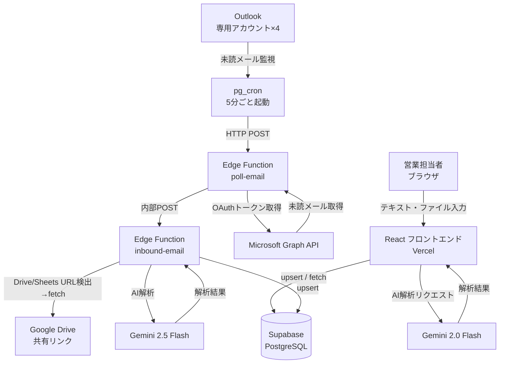

# AkiNavi HR-AI

「案件の空き」と「人材リソース」をAIで自動マッチングするシステム。  
**ログイン不要・ニックネーム制・即日利用可能。**

---

## できること

| 機能 | 説明 |
|---|---|
| AI マッチング | 案件と人材の相性スコア・理由をAIが自動生成 |
| 人材登録 | テキスト貼り付け・PDF・Excel・Word・画像をアップロードするだけで自動解析・登録 |
| 案件登録 | 同上。メール本文や要件定義書をそのまま貼り付けてOK |
| メール自動取り込み | 専用Outlookアドレスへの転送で自動解析・登録（5分以内） |
| デモ環境 | 本番データとは独立したデモ用データ環境（`?demo=KEY`でトグル） |

---

## システム構成図



---

## 技術スタック

| レイヤー | 技術 |
|---|---|
| フロントエンド | React 19, Vite 8, TypeScript, Tailwind CSS v4, TanStack Query v5 |
| DB / バックエンド | Supabase（PostgreSQL, Edge Functions, pg_cron, pg_net） |
| AI（ブラウザ） | Gemini `gemini-2.0-flash`（`VITE_GEMINI_MODEL` で変更可）・マルチモーダル対応 |
| AI（サーバー） | Gemini `gemini-2.5-flash`（Edge Function `inbound-email` 固定） |
| ファイル解析 | `pdfjs-dist`（PDF）・`xlsx`（Excel）・`mammoth`（Word） |
| メール自動受信 | Microsoft Graph API + Supabase pg_cron（**完全無料・Make.com不要**） |
| デプロイ | Vercel（フロント）/ Supabase（バックエンド） |
| テスト | Vitest, React Testing Library, MSW |

---

## ローカル開発環境のセットアップ

### 前提条件

- [ ] Node.js 20 以上（`node -v` で確認）
- [ ] npm 9 以上（`npm -v` で確認）
- [ ] Git

### 手順

**1. リポジトリをクローン**

```bash
git clone https://github.com/kzmiyamura/akinavi-hr-ai.git
cd akinavi-hr-ai
```

**2. 依存パッケージをインストール**

```bash
npm install
```

**3. 環境変数を設定**

```bash
cp .env.example .env.local
```

`.env.local` を以下の内容で編集:

```env
# Supabase（Dashboard → Settings → API から取得）
VITE_SUPABASE_URL=https://argizomylbolpqxgmvim.supabase.co
VITE_SUPABASE_ANON_KEY=（anon キーを貼り付け）

# Gemini（Google AI Studio から取得）
VITE_GEMINI_API_KEY=（APIキーを貼り付け）
VITE_AI_PROVIDER=gemini

# デモ環境の解除キー（任意・未設定でもOK）
VITE_DEMO_KEY=（任意の文字列）
```

**4. Supabase の DB を初期化**

Supabase Dashboard → SQL Editor で以下を**順番に**実行:

1. `supabase/schema.sql`
2. `supabase/migrations/` 配下のSQLをファイル名の昇順で全て実行

**5. 開発サーバーを起動**

```bash
npm run dev
```

ブラウザで `http://localhost:5173` を開く。

---

## 本番デプロイ手順

### Vercel（フロントエンド）

Vercel Dashboard → Environment Variables に以下を設定してから `main` ブランチへ push:

| 変数名 | 値 |
|---|---|
| `VITE_SUPABASE_URL` | Supabase の URL |
| `VITE_SUPABASE_ANON_KEY` | Supabase の anon キー |
| `VITE_GEMINI_API_KEY` | Gemini API キー |
| `VITE_AI_PROVIDER` | `gemini` |
| `VITE_DEMO_KEY` | デモ解除キー（任意） |

### Supabase Edge Functions

```bash
# メール解析
npx supabase functions deploy inbound-email

# Outlook ポーリング
npx supabase functions deploy poll-email
```

**Edge Functions Secrets**（Supabase Dashboard → Edge Functions → Secrets）

| Secret 名 | 用途 |
|---|---|
| `GEMINI_API_KEY` | Gemini API キー |
| `GRAPH_CLIENT_ID` | Azure AD アプリのクライアント ID |
| `GRAPH_CLIENT_SECRET` | Azure AD アプリのクライアントシークレット |
| `GRAPH_REFRESH_TOKEN_HUMAN` | 人材用メール（prod）のリフレッシュトークン |
| `GRAPH_REFRESH_TOKEN_PROJECT` | 案件用メール（prod）のリフレッシュトークン |
| `GRAPH_REFRESH_TOKEN_HUMAN_DEV` | 人材用メール（demo）のリフレッシュトークン |
| `GRAPH_REFRESH_TOKEN_PROJECT_DEV` | 案件用メール（demo）のリフレッシュトークン |
| `INBOUND_CALL_KEY` | poll-email → inbound-email 呼び出し用 JWT（service_role キー） |

**pg_cron スケジュール登録**

`supabase/migrations/add_email_polling_cron.sql` の `YOUR_PROJECT_REF` と `YOUR_SERVICE_ROLE_KEY` を実際の値に書き換えて SQL Editor で実行。

---

## テスト実行

```bash
npm run test:run   # 全テスト（CI向け）
npm run test       # ウォッチモード（開発向け）
```

---

## リファレンス

### メール受信アドレス

5分ごとに未読メールを自動取得・解析・DB保存。処理完了後に既読マーク。

| 種別 | アドレス | data_env |
|---|---|---|
| 人材登録用（本番） | `akinavi.hr.ai.voice.human@outlook.jp` | `prod` |
| 案件登録用（本番） | `akinavi.hr.ai.voice.project@outlook.jp` | `prod` |
| 人材登録用（デモ） | dev 用アカウント | `demo` |
| 案件登録用（デモ） | dev 用アカウント | `demo` |

### メール自動受信フロー（Graph API ポーリング）

```
pg_cron（5分ごと）
  ↓ HTTP POST
poll-email Edge Function
  ├─ Graph API: リフレッシュトークン → アクセストークン取得（ローテーション保存）
  ├─ GET /me/messages?$filter=isRead eq false（最大3件/アカウント）
  ├─ 各メール処理:
  │   1. markAsRead（二重処理防止）
  │   2. 添付ファイル取得
  │   3. inbound-email へ POST
  │   4. 失敗時は markAsUnread（次回再試行）
  └─ 4アカウントを Promise.allSettled で並列処理
  ↓ 内部POST
inbound-email Edge Function
  ├─ HTML → プレーンテキスト化
  ├─ Google Drive / Sheets / Docs URL 検出・自動取得
  ├─ Word / Excel 添付 → テキスト変換
  ├─ Gemini 2.5 Flash で AI解析（temperature=0）
  └─ DB保存（candidates / projects / candidate_skills / ai_logs）
```

### ブラウザからのファイル解析フロー

```
ファイル選択（PDF / Excel / Word / 画像）
  ├─ PDF    → pdfjs-dist でテキスト抽出 → テキストエリアへ転記
  ├─ Excel  → xlsx (SheetJS) でCSV変換 → テキストエリアへ転記
  ├─ Word   → mammoth で本文抽出 → テキストエリアへ転記
  └─ 画像   → base64変換 → Gemini multimodal API（inlineData）で直接解析
  ↓
Gemini 2.0 Flash で解析 → Supabase に保存
```

> スキャンPDF（画像化されたもの）はテキスト抽出不可。画像ファイルとして添付してください。

### データ環境（prod / demo）

同一Supabase内でデータを論理分離。`data_env` カラムでフィルタリング。

| 環境 | 用途 | 切替方法 |
|---|---|---|
| `prod` | 本番データ（実際の人材・案件） | デフォルト |
| `demo` | 営業デモ用サンプルデータ | URLに `?demo=<VITE_DEMO_KEY>` を付加 |

### DB テーブル一覧

| テーブル | 用途 |
|---|---|
| `candidates` | 人材マスタ（`data_env` で prod/demo 分離） |
| `projects` | 案件マスタ（`data_env` で prod/demo 分離） |
| `submissions` | マッチング提案履歴（スコア・AI要約） |
| `candidate_skills` | スキルのカテゴリ別管理（14カテゴリ・CHECK制約） |
| `ai_logs` | AI解析実行ログ（モデル・所要時間・結果・エラー） |
| `app_config` | アプリ設定 / Graph API リフレッシュトークンのローテーション保存 |

### candidate_skills の14カテゴリ

| カテゴリキー | 内容・例 |
|---|---|
| `languages` | Python, TypeScript, SQL 等 |
| `frameworks` | React, Laravel, Django 等 |
| `libraries` | jQuery, NumPy 等 |
| `os` | Linux, Windows, macOS 等 |
| `databases` | PostgreSQL, Redis, MongoDB 等 |
| `dwh` | Snowflake, BigQuery, Tableau 等 |
| `clouds` | AWS, GCP, Azure 等 |
| `infrastructures` | Docker, Kubernetes, Terraform 等 |
| `tools` | Git, Jira, Slack, Notion 等 |
| `methodologies` | アジャイル, スクラム, PM 等 |
| `certifications` | AWS認定, 情報処理技術者 等 |
| `design` | Figma, Illustrator, Photoshop 等 |
| `marketing` | SEO, SNS運用, Web広告 等 |
| `others` | 上記以外 |

### ディレクトリ構成

```
akinavi-hr-ai/
├── src/
│   ├── lib/
│   │   ├── ai/               # AI プロバイダー抽象化
│   │   │   ├── types.ts      #   型定義（リクエスト・レスポンス）
│   │   │   ├── geminiProvider.ts  #   Gemini 実装（マルチモーダル対応）
│   │   │   ├── openaiProvider.ts  #   OpenAI スタブ（未実装）
│   │   │   └── index.ts      #   プロバイダー切替ファクトリ
│   │   ├── db/               # DB 操作
│   │   │   ├── candidates.ts
│   │   │   ├── projects.ts
│   │   │   └── submissions.ts
│   │   ├── inbound/          # メールペイロードパース
│   │   ├── fileParser.ts     # PDF・Excel・Word テキスト抽出、画像 base64 変換
│   │   ├── dataEnv.ts        # prod/demo 環境切替
│   │   └── supabase.ts
│   ├── pages/                # 各画面（Matching / Candidate / Project）
│   └── components/           # 共通 UI（DemoSeedPanel 等）
├── supabase/
│   ├── schema.sql            # DB テーブル定義・RLS ポリシー
│   ├── migrations/           # 追加マイグレーション SQL
│   └── functions/
│       ├── inbound-email/    # メール解析 Edge Function
│       └── poll-email/       # Outlook ポーリング Edge Function
└── docs/
    ├── Sales_Manual.md       # 営業担当者向け操作マニュアル
    └── test-reports/         # テストレポート
```

---

## 問い合わせ・引き継ぎ

- GitHub: [kzmiyamura/akinavi-hr-ai](https://github.com/kzmiyamura/akinavi-hr-ai)
- Supabase プロジェクト ID: `argizomylbolpqxgmvim`
